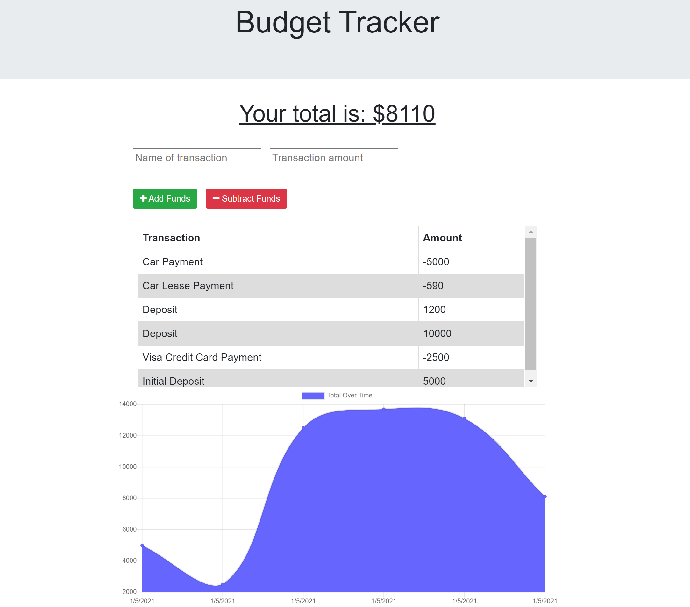

# Online-Offline-Budget-Trackers

This Online-Offline-Budget-Trackers app allows users to track their daily expenses.  

The complete webpage has been developed in node.js, using JQuery to manipulate the DOM, mongoose to manage the mongo dB as well as IndexDB to storage the transactions when the server is offline, JQuery AJAX method to make the call out to the API, Bootstrap for styling purposes.

[Click here to go to the live site](https://infinite-stream-37996.herokuapp.com/)

---

## User Story

AS AN avid traveller
I WANT to be able to track my withdrawals and deposits with or without a data/internet connection
SO THAT my account balance is accurate when I am traveling

---

## Acceptance Criteria

GIVEN a user is on Budget App without an internet connection
WHEN the user inputs a withdrawal or deposit
THEN that will be shown on the page, and added to their transaction history when their connection is back online.

---
## Technologies

- Node.js
- JQuery
- Boostrap
- Express
- IndexDB
- PWA
- Mongo
- Mongoose
- MongoDB Atlas

---
## References

- Mongoose, https://www.npmjs.com/package/mongoose

- Node.js, https://nodejs.org/en/docs/

- Bootcampspot, John Hopkins Univetsity, PWA Project 

- Bootstrap, https://getbootstrap.com/

- JQuery W3Schools, https://www.w3schools.com/jquery/

- MongoDB Atlas, https://www.mongodb.com/cloud/atlas

